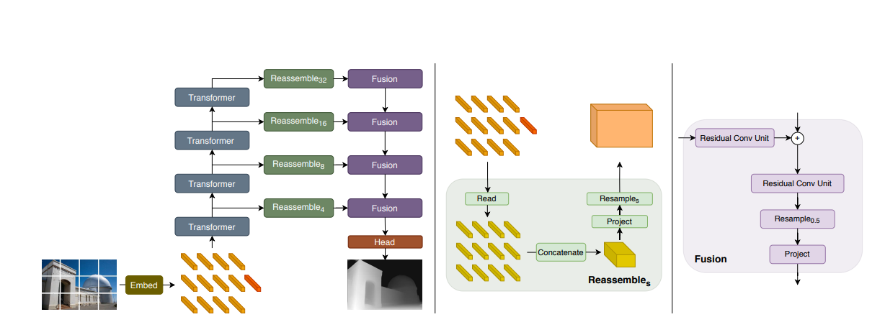

# DPT 모델에 대한 이해

## 기존 Depth Predict

기존 아키텍쳐는 CNN. 인코더는 backbone(이미지 분류 네트워크), 디코더는 인코더의 특성을 집계하여 최종 예측으로 변환.  
인코더에서 손실된 정보는 디코더에서 복구할 수 없기에 backbone이 모델 능력에 영향을 줌.

CNN에 사용하는 backbone은 이미지의 특성을 추출. 그러나 특징 해상도와 세분성 손실로 인한 디코더 복구 어려움.  
이미지 분류에서는 중요하지 않을 수 있지만 특성을 보아야하는 문제에서는 중요.  

특성 세분성 손실 완화를 위해서 dilated convolution, skip connection, 여러 해상도 표현의 병렬 연결을 사용.  
예측 품질 크게 향상, 그러나 convolution으로 인한 병목 현상 발생. 따라서 실행 가능한 수준이 되려면 중간 표현 다운샘플링 필요.

### Backbone이란?

ResNet 등의 특징을 추출하는 기본 아키텍쳐. convolution과 pooling을 통해 추상, 고차원적으로 압축(다운샘플링)  

## DPT vs ResNet

MiDaS는 기존에 ResNet을 사용하다 DPT로 바뀜.  
DPT는 '깊이 예측 분야에서 ViT(Vision Transformer)를 어떻게 적용할 수 있을까'에 대한 질문에서 시작.  
기존 Dense Prediction 에서 2가지 특징이 있다. encoder-decoder 구조에다가 CNN 기반 backbone이 쓰임.  
그런데 여기서 한계는, CNN 기반 backbone을 쓸 경우 다운샘플링을 무조건 거치게 됨으로 중요 feature가 손실됨.  
ResNet은 여기서 skip connection을 썼지만 문제가 해결되지 않음.  

ViT는 다운 샘플링이 없기 때문에 초기 이미지의 해상도 정보를 그대로 가져갈 수 있음. 그리고 전역적 정보 학습이 가능함.  

### DPT와 ResNet의 차이

1. Transformer 기반 (DPT)
> Self-Attention 메커니즘을 활용하여 이미지의 전역적 관계(global context)를 학습
> 이미지의 모든 부분 간 상관관계를 효율적으로 모델링
2. Residual Connection 기반 (ResNet)
> 스킵 연결(skip connections)을 도입하여 이전 층의 입력을 다음 층의 출력에 더함.

2. 토큰화 (DPT)
> 이미지를 작은 패치(patch)로 분할하고, 각 패치를 입력으로 변환하여 처리
> 각 패치를 "토큰"으로 취급하며, 이를 Transformer에 입력

3. 전역 정보 학습 (DPT)
> DPT는 멀리 떨어진 픽셀 간의 관계를 학습하는 데 강점을 가지며, 복잡한 장면 이해에 유리
4. 지역적 정보 학습 (ResNet)
> 합성곱 연산(convolution)으로 국소적(local) 특징을 학습하는 데 최적화

## DPT에 대한 이해

ViT에서 토큰 임베딩 이후 Special token을 더하는 것 까지 DPT는 따름. 
Transformer의 특정 깊이별로 따로 결과를 내고 Reassemble 후 fusion하여 layer 마다 '합쳐서' 특성 표상(feature representation) 함. 