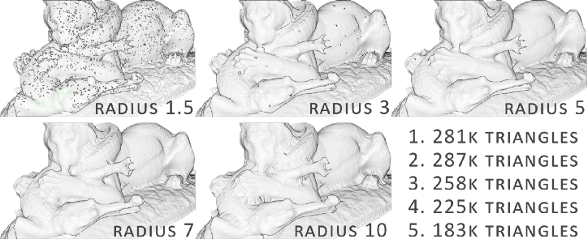

# 3D Reconstruction

MiDaS Depth Maps --> 3D

# open3d Ballpoint.

point cloud에 있는 점들 사이 edge가 있다. 그 edge는 빈 공간으로, 그 직경보다 큰 공이 굴러다닌다. 그 자취를 이으면 mesh가 된다.  

* 점과 점 사이 직경이 공보다 클 경우, mesh가 사라진다.  

* 위와 같이 ball의 radius가 작을 수록 '푹 빠져버리는' 상황이 생긴다.
* 이를 해결하기 위해 푸아송 재구성(천으로 point cloud를 감싼다)